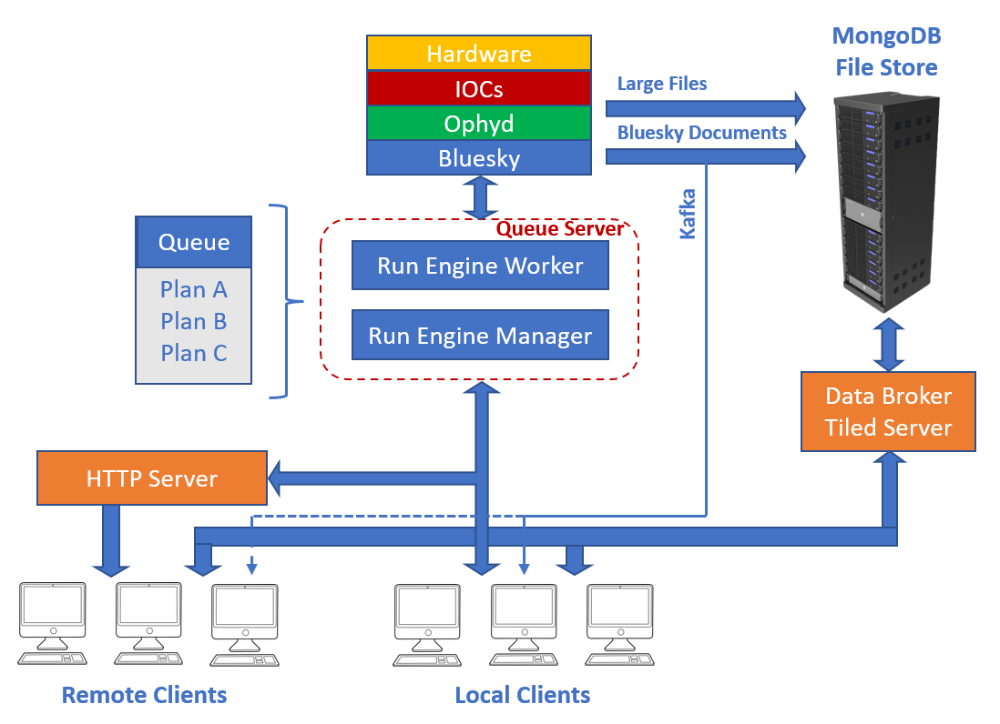

============
Introduction
============

What is Bluesky Queue Server?
-----------------------------

Bluesky Queue Server is a set of tools that provide alternative method for executing
`Bluesky <https://blueskyproject.io/bluesky>`_ plans. The Queue Server includes the core
`bluesky-queueserver <https://github.com/bluesky/bluesky-queueserver>`_ package and
`bluesky-queueserver-api <https://github.com/bluesky/bluesky-queueserver-api>`_, 
`bluesky-httpserver <https://github.com/bluesky/bluesky-httpserver>`_ and 
`bluesky-widgets <https://github.com/bluesky/bluesky-widgets>`_ packages that implement
additional functionality. Traditionally Bluesky was used interactively
from IPython environment as demonstrated in
`Bluesky tutorials <https://blueskyproject.io/bluesky/tutorial.html>`_.
A session would start by loading startup scripts that define beamline-specific devices and plans
(see a typical example of Bluesky startup code used by
`NSLS2 SRX beamline <https://github.com/NSLS-II-SRX/profile_collection/tree/master/startup>`_)
and then interactively running plans one-by-one from IPython prompt or executing a script that
runs a sequence of plans. Interactive IPython workflow is currently the most common way to
use Bluesky.

Alternatively, the Queue Server allows to run Bluesky in a dedicated Python process
(Run Engine worker environment). The worker environment is created and managed by Run Engine (RE)
Manager (see :ref:`start_re_manager_cli`), which could be run as an application or a service.
As in IPython workflow, the startup code is loaded into the environment and
the beamline devices and plans are available in the environment namespace. Bluesky plans
are executed by populating and starting the plan queue maintained by RE Manager. The queue is
editable and can be modified by users at any time: queue items may be added to the queue,
replaced (edited), moved to different positions and removed from the queue.

Queue Server is designed to accept startup scripts developed for interative IPython
workflow after minor modifications. It is acknowledged that the maintenance of
startup scripts takes a lot of effort. The startup scripts adapted for Queue Server
can always be loaded in IPython environment used in both Queue Server and interactive
IPython workflows without modifications.

RE Manager is fully controlled over 0MQ using a :ref:`comprehensive set of API <run_engine_manager_api>`,
which allows to open and close the worker environment, control the plan queue, monitor the state of RE Manager,
execute scripts and functions, etc. The API-controlled execution environment does not provide flexibility
of IPython-based workflow, but it is more convenient for the development of GUI applications or autonomous
agents for local or remote control of experiments. RE Manager is designed to be self-sufficient and
may complete execution of populated plan queue without user intervention, allowing to decouple control GUI
or agent from the plan execution engine: in case of failure, the higher level control software could be restarted
without interfering with the running experiment. User applications or control agents may access RE Manager
remotely using 0MQ API on the local network (as long as RE Manager may be accessed from the machine running
the control software). `Bluesky HTTP Server <https://blueskyproject.io/bluesky-httpserver/>`_ is designed to
control RE Manager from outside the local network and provides a matching set of REST API and basic authentication,
authorization and access control. The HTTP Server communicates with RE Manager over 0MQ and needs access to
the local network.

Using low-level 0MQ API (RE Manager) or REST API (HTTP Server) in Python client applications
or scripts may not be convenient: the API are not user-friendly and proper use of API
may require understanding of internals of RE Manager. Also 0MQ and REST API are implemented using
different incompatible libraries, therefore two versions of communication code need to be developed and
maintained to support both protocols (e.g. an application that can work locally via 0MQ and remotely via HTTP).
The higher level Python API package
(`Bluesky Queue Server API <https://blueskyproject.io/bluesky-queueserver-api>`_)
was developed to support more convenient and universal interface for communication with
RE Manager. The package contains API for synchronous and asynchronous (*asyncio*) communication over 0MQ and HTTP.
The API hides many low-level communication details and allows to write the code that works identically with both
protocols (except initialization parameters, which are different for 0MQ and HTTP).

The *bluesky-queueserver* package provides a simple CLI application (:ref:`qserver_cli`)
for controlling RE Manager over 0MQ. The application may be useful for testing
RE Manager, troubleshooting issues and simple demos. The :ref:`tutorials <tutorials_queue_server>`
explore the features of the Queue Server using *qserver* CLI tool.

The *bluesky-widgets* package contains implementations of reusable Qt widgets for controlling RE Manager and 
manipulating the queue and ready to use *queue-monitor* GUI application based on the widgets.  

Features of Bluesky Queue Server
--------------------------------

The core component of the Queue Server is Run Engine (RE) Manager, which supports the following features:

- Run Engine (RE) Worker environment, which could be opened/closed/destroyed via API requests. The Bluesky startup code
  is loaded as the environment is opened. The RE Worker process is closed/killed as the environment is closed/destroyed.

- Support for startup code represented in IPython format (a startup directory with alphabetically ordered code files), 
  as a Python script or a module.

- Fully editable queue of plans and instructions. The API support for adding/replacing/moving/removing individual 
  queue items and batches of items. The instructions are executed by RE Manager and control execution of the queue. 
  Only one instruction (`queue_stop`) is currently supported.

- API for controlling execution of the queue (:ref:`start <method_queue_start>`/:ref:`stop <method_queue_stop>` 
  the queue) and the plans (:ref:`pause <method_re_pause>`/:ref:`resume/stop/abort/halt <method_re_resume_stop_abort_halt>`).

- API for monitoring of status of RE Manager, Worker and Run Engine (see :ref:`method_status`)

- Locking access to API for controlling RE Worker environment and/or the plan queue (see :ref:`locking_re_manager`).

- Submit and immediately start execution of a plan (see :ref:`method_queue_item_execute`).

- Execute a function defined in RE Worker namespace (see :ref:`method_function_execute`).

- Uploading and executing Python scripts, which may define new or modify existing devices, plans or functions 
  (see :ref:`method_script_upload`).

- Restricting user access to plans and devices. Users may be assigned to groups and each group may restricted in which plans
  users may submit to the queue and which devices users may pass with plan parameters (see :ref:`managing_user_group_permissions` 
  and :ref:`configuring_user_group_permissions`).

- Annotations for Bluesky plans (see :ref:`annotating_bluesky_plans`).

- Validation of submitted queue items (see :ref:`validation_of_queue_items`).

- Remote monitoring of RE Manager console output (see :ref:`remote_monitoring_of_console_output`).

- Encryption of 0MQ control communication channel (fixed public-private key pair).

- Functions for writing startup code compatible with interactive IPython workflow 
  (see :ref:`organizing_bluesky_startup_code`).

- *qserver* CLI tool for controlling RE Manager (intended for simple operations, system evaluation and demos, see
  :ref:`qserver_cli`).

Integration of Bluesky Queue Server in Data Acquisition System
--------------------------------------------------------------

This section illustrates the role of the Queue Server in generic Data Acquisition system. The system collects
small data and scan metadata in the form of Bluesky documents to MongoDB (directly or via Kafka) and large data files
from detectors to the File Store. Data acquistion is controlled by local and/or remote clients.

The Queue Server (started as Run Engine Manager application or service) is running two processes: RE Manager process
and RE Worker process. RE Manager process is responsible for maintaining and controlling the plan queue and 
0MQ communication with clients. The process is expected to be running for the duration of the session, but it
can be restarted without closing the application or disrupting queue execution in case of failure. 
RE Worker process is created as the worker environment is opened and closed/killed when the environment is 
closed/destroyed. Operations of opening, closing and destroying the environment are controlled using the API 
and may be performed as often as necessary for the workflow. The Worker process is used to run the Bluesky code.

The queue is stored outside RE Manager (in Redis) and persists between restarts. The local clients (with access to
the local network) communicate with the Queue Server using 0MQ API. Remote clients connect to HTTP server and
use REST API to control the Queue Server. The HTTP Server must be able to reach RE Manager over the local network.
All the clients are able to subscribe and remotely monitor the console output of RE Manager.

The Bluesky stack, including Bluesky and Ophyd, is running in RE Worker process. The startup code is loaded into RE Worker
namespace as the environment is opened, beamline-specific set of devices, plans and functions become available in
RE Worker namespace and could be started by clients using control API. As the plans are executed, the Ophyd code 
communicates with EPICS IOCs (to control hardware) over the network and Bluesky code generates documents that are 
saved into MongoDB and/or published to Kafka depending on the Run Engine subscriptions.
